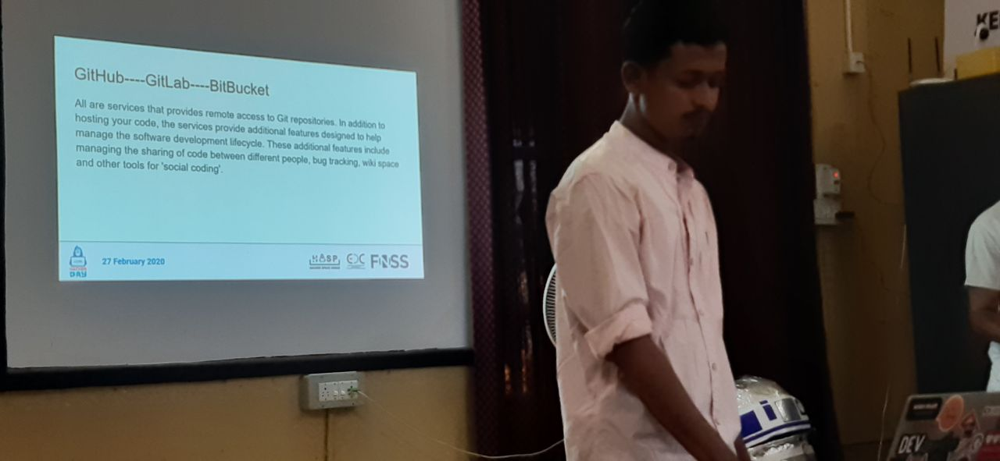
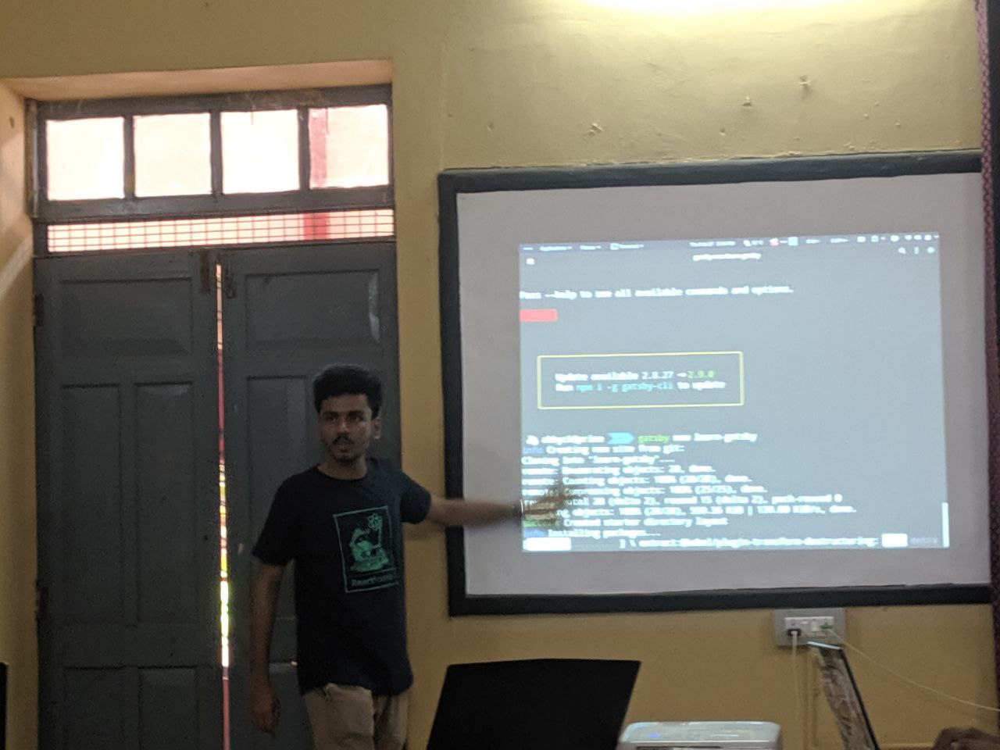

What, How, Why are some of the interrogative adverbs (yes, I googled it!) that we often use. These would also be the words that decorates the first part of all our google search engine queries. We can't actually rank these adverbs as they are used in seperate contexts. But as some motivational wizards claims, the why part is most important. In my perspective, it is because if we have a pretty good and strong answer for the why part, the rest doesn't matters anymore. Suppose one of your friend met with an accident and hospitalized (just imagine). You are in the middle of nowhere at midnight. You have no transport facility. But still you would walk in the direction of the hospital hoping for the best (Yes, this was the best analogy i could come up with!). My point is, since the why part was sound, the rest were not a matter⚡. 

<em>HackerSpace NSSCE💗.</em>

I can go long explaining what HackerSpace is (not really), but we are people who love one line clarification than a paragraph of explanation. As the name suggests, HackerSpace is a space where people hack. What good does one more confined space do to an institution. This 'version of the question is obsolete and no longer in support'. It was relevant once. But that days are gone. We can change the world within that space surrounded by the walls. It was not possible before but it is now. One can change how the world works just sitting infront of a computer. The smart phones held in our hands are millions of times more powerful than the Apollo 11 guidance computers. Hence it's proved a room is amble. But it can be any space with four walls and a ventilation(i can't even imagine a room without those). It's not just about a 8GB RAM laptop or unlimited wifi with 5 mb per second speed. It's about the people who accompany us. Yes, it all comes back to those four letters some motivational gurus have monopoly over. TEAM (It seems so cliche)🔛.

<em>Hack Day session on Git & Github.</em>

These days when teenagers are capable of learning autonomously and producing outstanding results individually, one might wonder just how important collaboration and teamwork really are in the creative industry. Would it not be simpler for them to do what they are trained to do without having to share their ideas, without having to agree to a compromise that satisfies someone else’s taste, without feeling obligated to give up ideas in order to incorporate the thinking of others into the work? 
The key to the answer is the mindset. Looking at it as an obligation, a forced collaboration isn’t going to reveal the many benefits that working in a team has. Rather, it can limit an individual’s ideas and skills to his or her predetermined ideas and skills. But, when collaboration happens organically, the benefits are enormous on many levels.

<em>Hack Day session on Web development using Gatsby.</em>

Collaborating with creatives who have a similar mindset but different skills or experience can directly benefit you. A team member with more in-depth knowledge, previous experience with a specific task, another perspective on a situation requiring problem solving, or even just a new shortcut in your favorite software, can teach you new information in practice, while you and others are applying it together in real time.During creative team work, students get to know not only each other, but also themselves. They can analyze their own skills, efficiency and reactions to requests. They can reflect on their response to critiques, to the pressure of time and responsibility. They can re-evaluate their critical thinking and decision-making skills.(The Importance of Collaboration and Teamwork in the Creative Industry by Julius Dobos in July 11, 2017) 
The productivity of a team versus those of an individual has obvious benefits for the creative project. Of course, a team has a larger cumulative knowledge base across more minds with more ideas. Used effectively, this results in more condensed production processes. If the team is a well-organized one, this also ensures better productivity, often higher quality, more creative output, longer-lasting motivation, greater efficiency and faster delivery (Don't sue me, I just cited you). These are perk you can enjoy only being part of a team.

<em>Hack Day session on Front-end development.</em>

HackerSpace is not the cliche club people who conduct programmes to enter it in report or arrange meetings to fill the minutes book. We don't believe in reports and paperworks but the actual work done to solve real-life problems. If you do something amazing one day, it can be coincidence. If it happens twice, it can be pressure or infactuation. But if you are consistent, then it becomes a culture. We intend to cultivate that culture among ourselves.The realisation that your immature code can really make a difference is powerful. But nothing changes if nothing changes (You know where it is from). If you are passionate and foolish (as per Steve Jobs dictionary) enough to believe that you can make a change, then join us. Be part of this revolution...✌️

#keep calm and keep coding 

