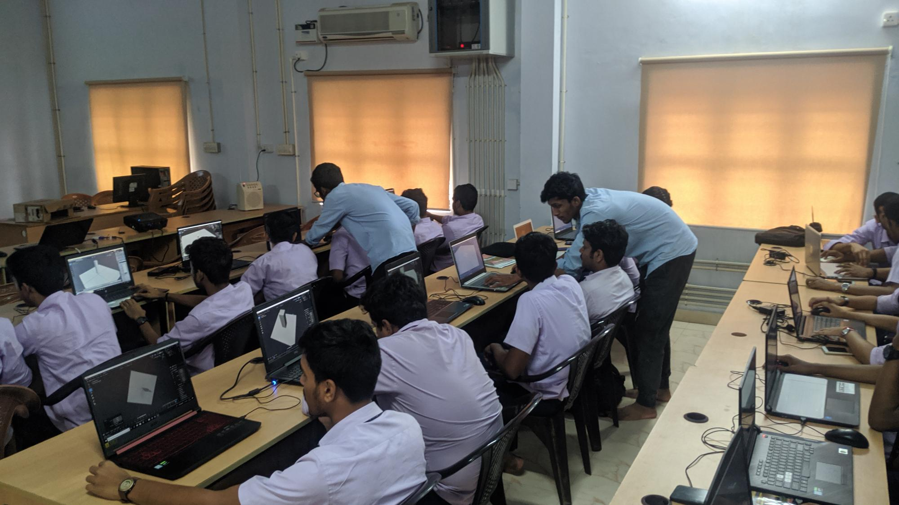
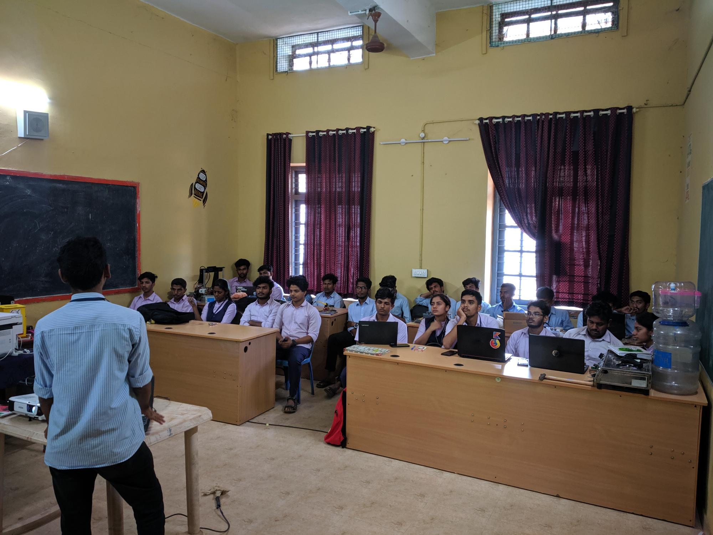

Exactly around this time is when the FOSSNSS was inaugurated. 
Yes, It's our first anniversary! None of us knew how to build a club or to bring people together. Yet, here we are. On our anniversary 🎉

<em>Praveen A. inagurating FOSSNSS</em>

# The journey that challenged and changed us!
Well, being inexperienced noobies in building a club(that too, technical)
we've come a long way. We can't thank enough for the efforts of our staff coordinator Asst. Prof. Syam Sankar for taking up this idea, assembling this team, and giving his all hands for FOSSNSS. 
In this one year of FOSSNSS gave me a glimpse of what the past used to be. My journey to being a FOSS enthusiast is short and perhaps the same age as the FOSSNSS itself. I still remember the day that started this venture, the frantic effort of my friends for most of which have never done any event or even public speaking. The strong support that was evident at the time and for which that event solely rests upon. 

## Challenges 
Like every other initiative, we had our own set of challenges. Luckily, with the help of our great team, we could easily overcome those. 
Being a club that is a little inclined towards technical things, our first challenge was finding people who were interested in our ideology and vision. I still don't know how we gathered the current set of people in the cell. Now I can proudly say that we have a set of members who are very active in our cell as well as in college, to spread and achieve our vision.

<em>Our first activity after inauguration in collabration with STACS - Blender Workshop</em>

After having a set of people with this motive, the next problem was to keep the community engaged. As I said earlier, being a more technically inclined club, we were having a little to none random interactions with the peers. This was a necessary thing to keep the community floating. So, we introduced weekly sessions on FOSS ideology, tools, or tech in general. Although we couldn't conduct these weekly sessions every week as planned, sure, it brought the community together. 

## Where we are now?
After this one year journey, our idea is growing. These various deliberate effort that has been taken found fruitful. From the initial team of 5-6 members, now we have around 30+ people who are very active in the cell. The cell has participation from 4 departments and is embracing multidisciplinary collaboration. 

<em>How I built my first web app - From one of our weekly sessions</em>

We have a great community of FOSS enthusiasts and activists ready to help whenever we are stuck. We are very much thankful for them. We have done 20+ events and many informal sessions that uphold the idea of sharing. This includes workshops, talks, hands-on, etc. Though initial participation was less, we are getting more and more people every day.

<em>I too took a few sessions :) </em>

## We are expanding!
We would like to be more manure the idea of FOSS and let the roots reach the deep into the NSSCE soil. Not to perish but to proliferate. We would like you to know that we have a chance for everyone out there, with more interesting events and an opportunity for everyone to foster their skills. 

Now we have a few more subdivisions under FOSSNSS so that everyone has a place. Building inner teams like this certainly helped in the destruction of the centralized architecture of FOSSNSS.

1. HackerSpace - As the name suggests, this is a place for all the hackers and tinkerers of NSSCE. One of the aims of HaSp(We call HackerSpace as HaSp) is to bring more upstream contributions from FOSSNSS as well as NSSCE.

2. OpenDesign - Deals with providing design guidelines to FOSSNSS and for everyone who likes to follow their stuff. OpenDesign will also act as a platform to educate people on FOSS Design tools and design languages. 

3. R3brut3(Rebrute) - A team that focuses on Cyber Security, bringing digital awareness, and help to people learn solving problems regarding Cyber Sec.

4. Coders tent - This is our sports team for our sport programmers 😉 They compete with each other to bring out the best of their programming ability and to teach others.

## Thank you!
We struggled a lot. This state that FOSSNSS is right now is not something that came by itself. It's only through the support from the great community around this FOSS world. We are so grateful to each and every person who helped us to get what we are on this journey. 
We still need your continued support in building this community. We are getting better each and every day.