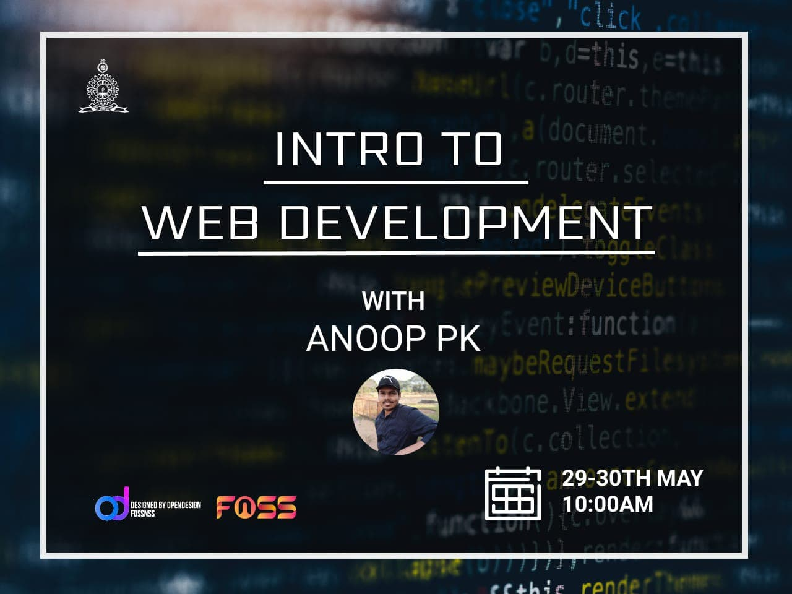
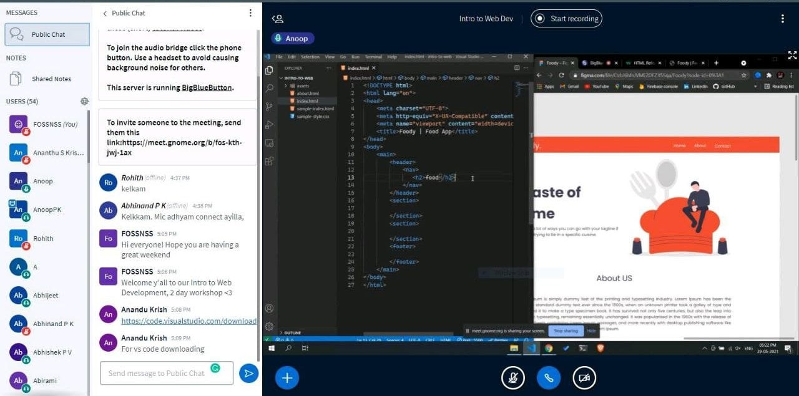
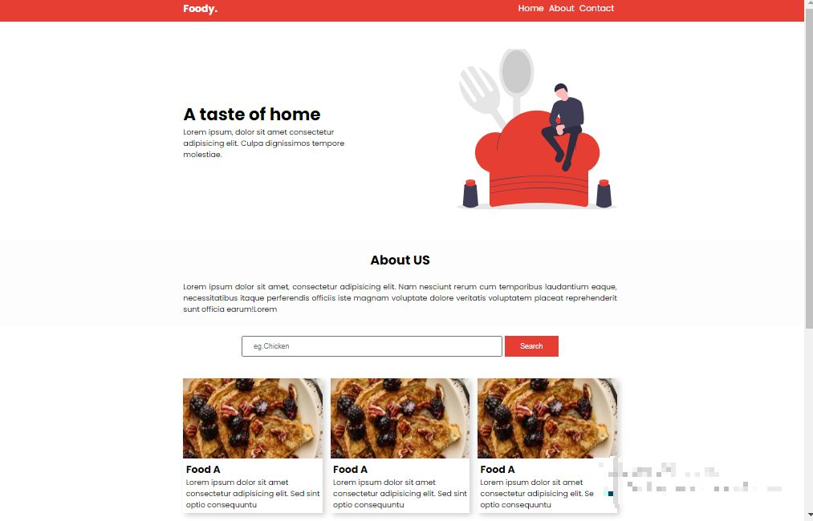

In these Covid times, everyone is trying to be out of the box by exploring different domains in different fields from cooking to learning Artificial Intelligence. To be one among them; I too planned to study Web Development cause there were many opportunities in this field.

For a few days I was voraciously skimming through websites, searching about web development but I stumbled on my way cause all the ideas and concepts were muddled in my head. This gave me a headache. After my hectic class schedule, I found some time trying to learn web development but most of the time I was chatting or surfing YouTube. Thus I wasn’t able to learn web development effectively and my self-study was an ultimate failure to be exact.

Later that week, FOSS NSSCE conducted a two-day session on 'Intro to Web Development' hosted by Anoop KP. I think that was an eye-opener for many of those who attended the session including me because he not only taught us the basics of web development but also helped in understanding how a programming language should be learned. More importantly, he also trained us to maintain that thirst for knowledge till the very end of the topic.

##DAY-1

In the first session, we were introduced to HTML and CSS which are considered as the core languages of web development. To build a website, HTML is considered to be the program that creates a well-structured skeleton of the website we are going to make and CSS is like a beautifying agent, which gives the website its external appearance.
On the first day, we were able to create a website named foody. 

Even though we were able to create the external appearance of the website due to lack of time we couldn’t embed the functions to the buttons in the website.

##DAY-2

Now, our website is just like a soul less body…. there is no emotion or interaction inside it. So, to provide the interaction we use a programming language called JavaScript (JS). While learning web development the hardest thing to master is JS. But the way our mentor taught us made it more easier to grasp the topic.
The last part was hosting which is skipped in most of the webinars, but we were able to witness how a website is hosted using an online hosting platform called Netlify.

The main spotlight of the event was that a complete website was built in front of us. We were able to master the basics of web development and along with that, we got the experience of doing a project, which is very hard to find in sessions like this.
I sincerely thank the members of FOSS NSSCE for conducting such a wonderful event and my special thanks to Anoop KP for being such a good mentor.

_Reference:_

- https://video.hardlimit.com/videos/watch/eb157e6a-93d7-44d3-92ce-df26d479ae75
- https://video.hardlimit.com/videos/watch/playlist/125a3cc0-536d-4268-996c-62757e715f5b
