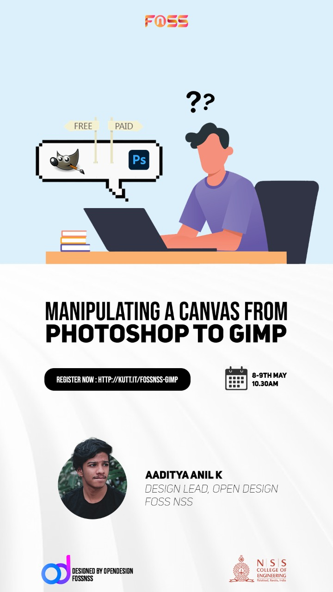
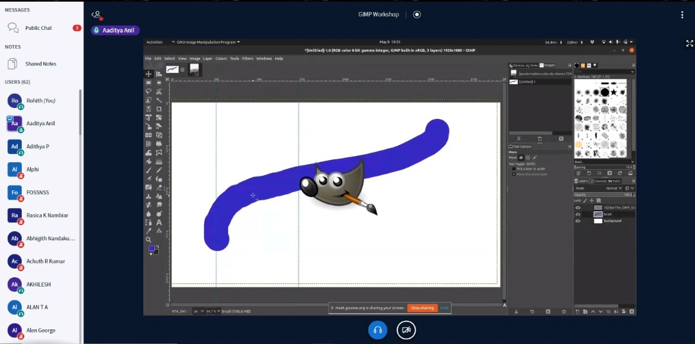

Exploring nourishes the curious minds providing them with the power to change stereotypes, thereby adding more filters to our view. That’s amazing right ? and it’s smart too, but how? Well, these explorers are well-equipped with knowledge as well as experience. Now when you try to fight with your fist, they fight with weapons. The worst part is some use knives to cut butter. That’s unnecessary. In this era, where the world is at our fingertips, we must work smart, not hard. Owing tools alone does not make you creative but knowing to crack it right makes you one. The brief insight I could grab after attending the gimp session conducted by the foss club and taken by Adithya anil.

Well, now let’s head into our business.  It was a two-day session and was very informative (not as dull as it sounds in my intro), welcoming, and perfectly time managed. On the first day, we got introduced to all the root tools. It was also an eye-opener for all those who don’t know how valuable gimp was. The other day, we looked up to all the tools that made gimp special in photo editing; By color select, foreground select are few examples. Of course, gimp is one of the best alternatives for Photoshop. The user interface is warm comparing other photo editing software. Not just that, gimp is a real pro at some tools too. The working of gimp is so neat that it offers an unlimited reversible path. Consumption of RAM is considerably less!; thus helps multi-tasking. Gimp files consume less space than ps files. This simple open-source software has as many tools for editing as there in Photoshop. Reality hit hard, but indeed, we cannot afford the highly paid Photoshop. So why not try gimp when it does not compromise its efficiency.

Well, it depends on comfort.  It will be worth a try for both beginners and a ps pro. Choose the tools wisely and effectively!; upgrade and improves your performance.

_Reference:_

- https://video.hardlimit.com/videos/watch/playlist/a3c96a94-61db-452d-80a8-d26ec37f3d61

