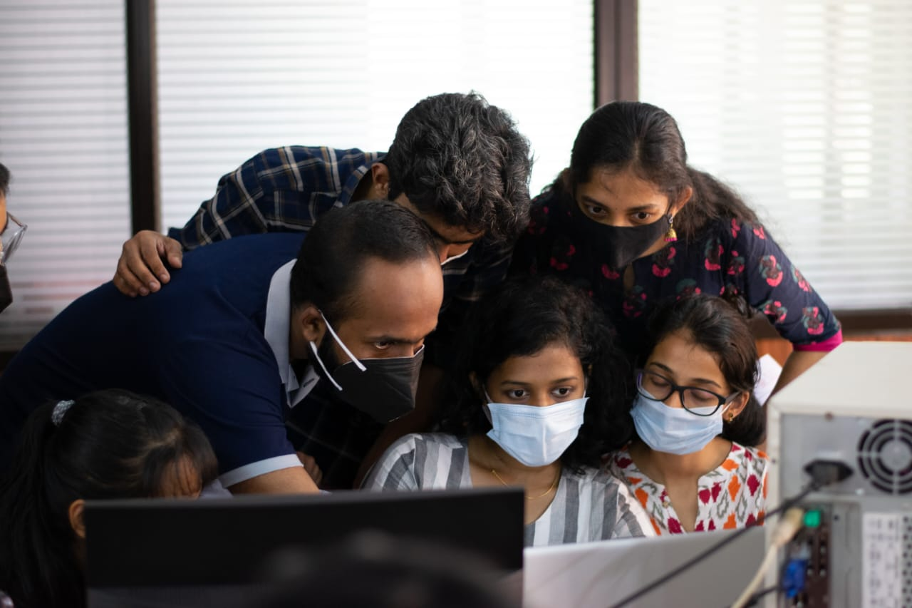
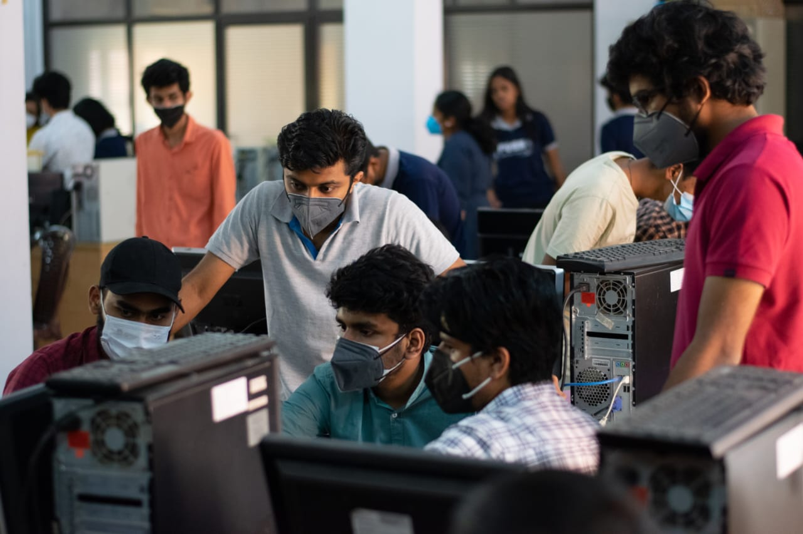
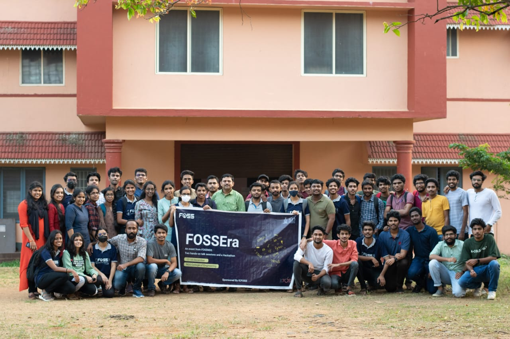
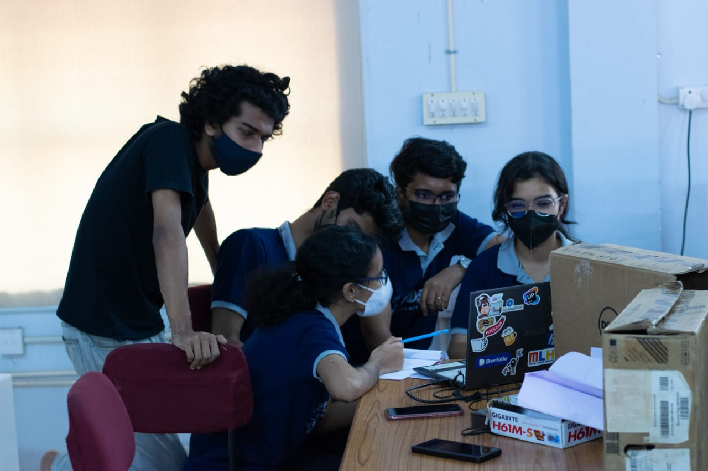
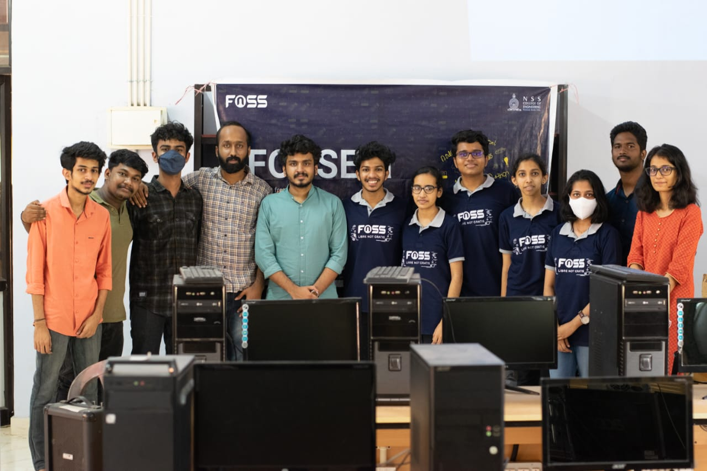

After the numerous amounts of online workshops and technical competitions I have participated to keep myself busy during the pandemic, I was eager to step into college for the first time and experience the real essence of offline events. That is when FOSS NSSCE began plans to host our first offline event after the lockdown period. 

I was so excited and thrilled to be a part of this event, specially because it was our first and it was the best opportunity to learn and get to know each other.

FOSSEra was conducted as a 2-day event comprising 2 hands-on interactive talk sessions and a 24-hour hackathon. Hackathons are like a timed race where a group of programmers collaborate with each other to develop a software that could possibly solve real-world problems. This was going to be my first Hackathon experience. 

## DAY 1

FOSSEra-Day 1 started with the inaugural ceremony at 9.15 AM. The Principal, Staff Coordinator of FOSS NSSCE and Head of the Computer Science department were present. After the inaugral session, the talk sessions began. Mr. Kannan VM and Mr Pirate Bady took a session for us based on Workflow using Git & How to speak VIM. The session was highly interactive and they made sure that each participant was able to follow and produce the desired output. The session covered the basics of HTML, CSS and Git. At the end of the session, we were given a small project which was to create a webpage using HTML/CSS and add the same to a website using Git. 

The second session was taken by Mr Akhil Varkey and Mrs Anupa Ann Joseph on Linux servers and Deployment of apps. They gave us an idea on how apps and static sites can be deployed using Linux Servers. Day 1 ended with the start of "Hackfiesta". We were given the themes and the rules for the hackathon. The hackathon contained problem statements from different domains like healthcare, education, finance and automation. We were allowed to use any free software tool to build anything, ranging from a simple website to a complex web app. Our group had a few members that already had a good insight into web development. The experience of working with them proved to be very valuable for me from an academic point of view. At the end of the day, we were busy dividing and assigning tasks among our members and contemplating on how to finish our project within the deadline. 

## DAY 2
Day 2 was the continuation of the 24-hour hackathon. We had chosen the theme-education and had decided to create an online website which would help university students and high-school students to search and get valuable information of their desired college. This oppurtunity gave me a good insight into some essential domains of Computer Science like Web Development and Database Management Systems. By 11am, the judges had come to evaluate us. The initial evaluation was a direct one-to-one interaction with the judges where they came and sat with us and had a good discussion on the topic. They evaluated us based on solution relevance, code quality, and prototyping. We also had 3 of our alumni and former FOSS NSSCE members to mentor us throughout the competition. They gave us ideas on how to improve our project and encouraged us to modify and fulfil all the shortcomings of the project. 

After the first evaluation, the top 5 teams were shortlisted and qualified for the next round. We were overjoyed as our team had made it to the top 5. The second round was completed with each of the teams presenting their idea, project, implementation and general aspects of their project infront of the whole crowd. Finally, the results were announced by our staff coordinator. 

The 2 days were undoubtedly a great learning experience for me. Being surrounded with people who have knowledge in various technical domains help us gain more experience and also provides us with new and interesting information everyday. The extra knowledge also goes a long way in terms of our future career, in addition to being an aid to our academics. I'm positive that all the people who took part in Fossera 2021 would love to be involved in an event like this again, be it as a participant or as a volunteer. 

THANK YOU !