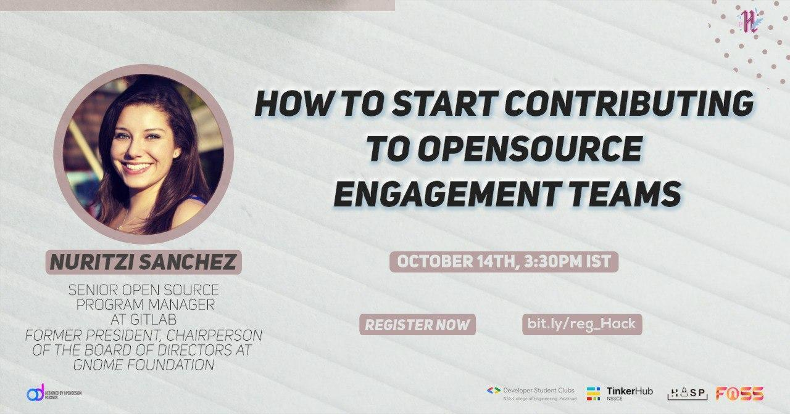

<em>Nuritzi Sanchez, Gitlab Open Source Program Manager, former President at GNOME FOundation</em>

Hacktoberfest NSSCE Team are proud to invite you all to the upcoming session **"How to start contributing to open source engagement teams" from _Nuritzi Sanchez_**, PMP, Senior Open source program manager at GitLab Inc. and former President, Chairperson of the Board of Directors at GNOME Foundation.

The session will be Free & Open for everyone!

**Date**: October, 14th

**Time**: 3:30 PM IST

__Session will be hosted in the BigBlueButton instance sponsored by GNOME__