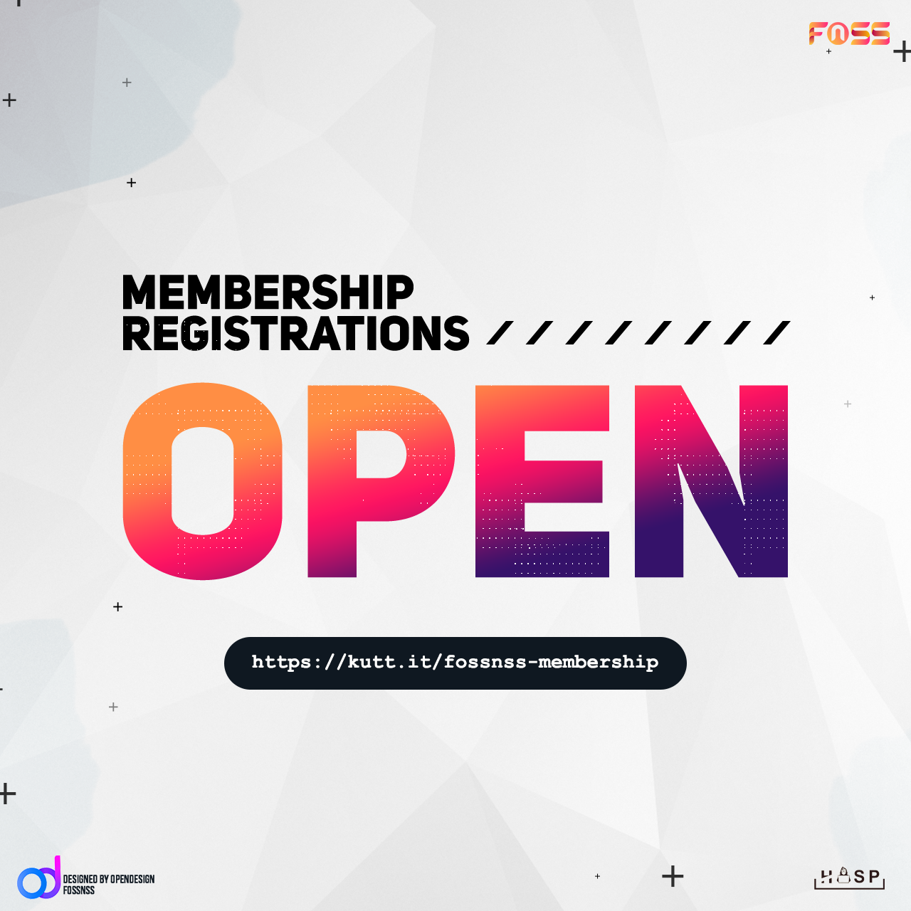

It has been 2 years since the official inauguration of **FOSS NSSCE** and it was time to welcome new members into the family. 

An orientation program is planning for the 1st year students of NSSCE to give them a brief intro to the world of FOSS. The main agenda of the program is to give the students a clear idea of what FOSS stands for and to eradicate the common misconceptions regarding FOSS.

----

**Date**: 25th April

**Time**: 6 PM

**Agenda**

- Introduction about FOSS
- Why a campus community like FOSSNSS?
- Our activities, past and future prospects.
- Brief introduction of our team, HackerSpace and OpenDesign

