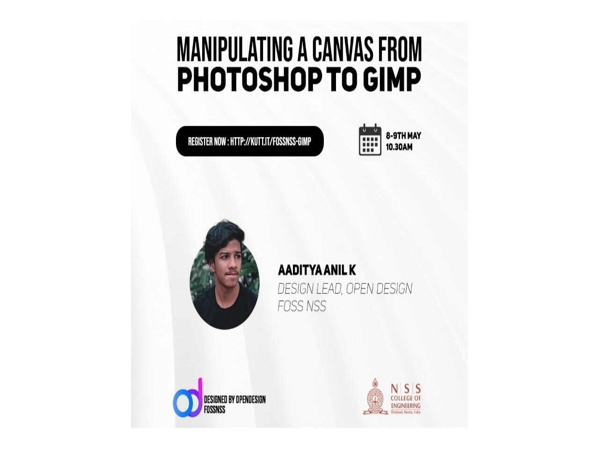

**"In real open source, you have the right to control your own destiny.”**
               _-Linus Torvalds_

_Want Photoshop, but don't wanna pay for it? Try GIMP!_

With the era of FOSS revolution, ditch Photoshop and give **GIMP** a chance! It is free, requires less storage, has the same capabilities as any other editing software and what’s more, you would be supporting open source movement!

**FOSSNSS** is proud to present our *2 day session on GIMP, held by **Aaditya Anil**, OpenDesign Lead , FOSS NSS.* His sessions will definitely bloom buds of creativity and imagination in you

🗓️ **Date:** 8-9th May 2021

⏱️ **Time:** 10.30 AM

_So what are you waiting for? Register up here!_

https://kutt.it/fossnss-gimp

_Recorded session is now available at:_

- https://video.hardlimit.com/videos/watch/playlist/a3c96a94-61db-452d-80a8-d26ec37f3d61

