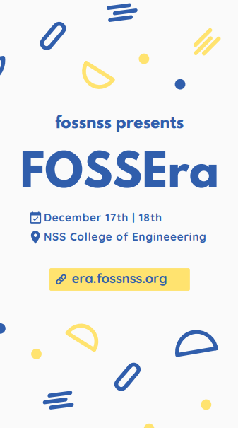

__FOSSEra'21__ 

FOSSNSS is hosting the first offline 2-day event after the lockdown exclusively for the students of NSS College of Engineering. FOSSEra incorporates a mix of 2 hands on sessions and a mind engaging 24-hour hackathon, "Hackfiesta v1.0". We aim to bring forward new opportunities and a platform for participants to exhibit the skills and knowledge they acquired during the lockdown. 
All people from absolute beginners to experienced folks will find a place in FOSSEra. 

🗓️ **DATE and TIME:** Dec 17 2021 09:00 AM - Dec 18 2021 05:30 PM

Come, join us and experience FOSSEra firsthand!!

